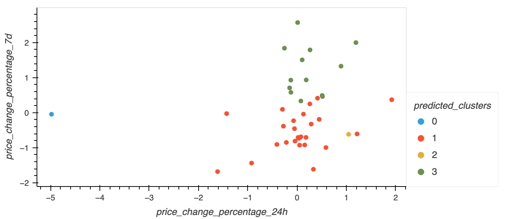

# CryptoClustering

CryptoClustering is a an exercise to practice unsupervised machine learning techniques such using K-means with the elbow method and principal component analysis (PCA).

This script predicts if cryptocurrencies are affected by price changes over different time scales.

Data was generated by edX Boot Camps LLC and is found in the Resources folder.

### Elbow Plots
</img>
</img>

### Prediction Plots
</img>
</img>
---
Repository was made for UCB Data Analytics Challenge 19

Author - Jacob Pohs

Contributions by edX Boot Camps LLC